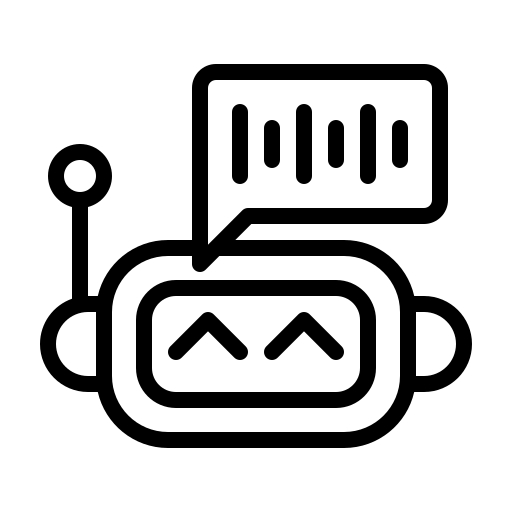
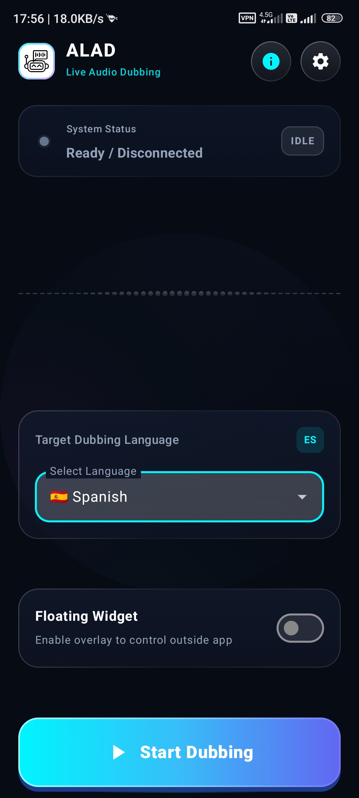
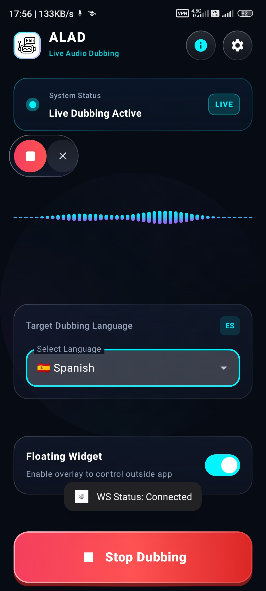
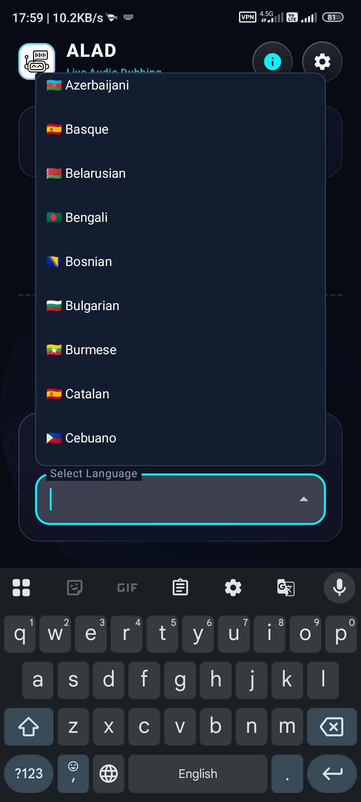
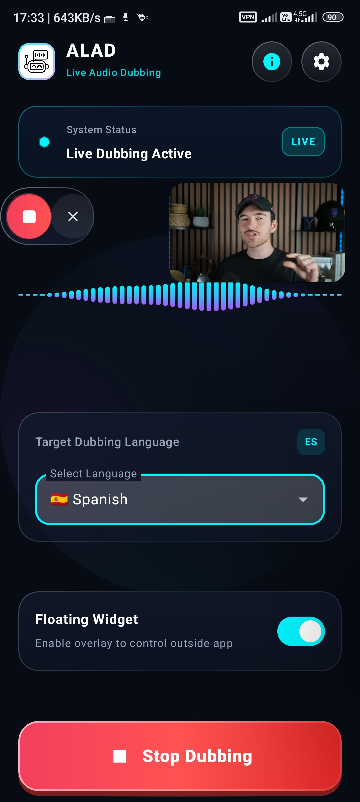
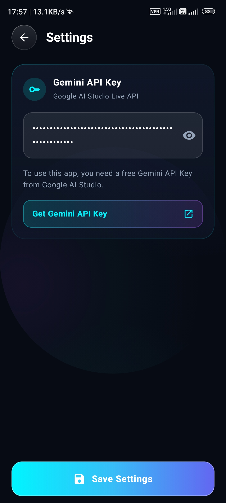
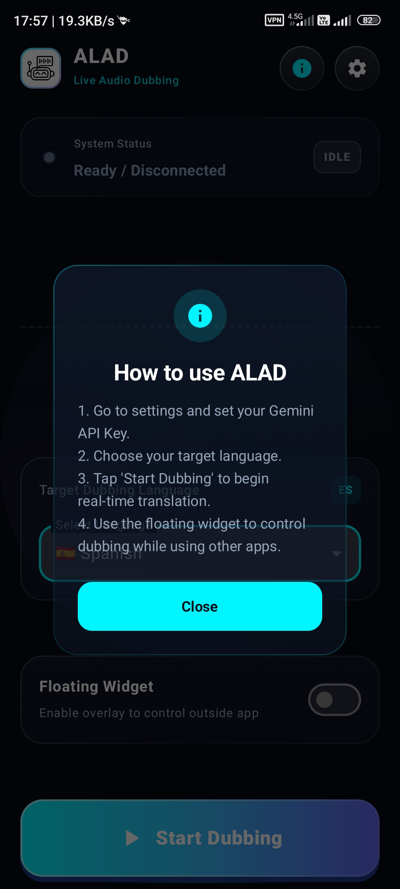

<div align="center">
  🌐 <strong>Read in English</strong> | <a href="README-fa.md">خواندن به زبان فارسی</a>
</div>

<div align="center">
  

<h1>🎙️ ALAD — AI Live Audio Dubbing (Mobile)</h1>

<p><strong>Real-time AI voice dubbing for any Android app, powered by Google's Gemini 3.5 Live Translate.</strong></p>

<p>
  <a href="https://github.com/navidseyedain/ALAD-Mobile/stargazers"></a>
  <a href="https://github.com/navidseyedain/ALAD-Mobile/releases/latest"></a>
  <a href="https://developer.android.com/"></a>
  <a href="https://kotlinlang.org/"></a>
  <a href="https://aistudio.google.com/"></a>
  <a href="https://github.com/navidseyedain/ALAD-Mobile?tab=readme-ov-file#%EF%B8%8F-78-supported-languages"></a>
  <a href="LICENSE"></a>
</p>

<p>
  <b>Watch any foreign video or listen to any podcast. Hear it in your native language — instantly.</b><br/>
  No subscriptions. No accounts. 100% free and open-source.
</p>

<a href="https://github.com/navidseyedain/ALAD-Mobile/releases/latest"></a>

<br/>

</div>

---

## 🌍 What is ALAD Mobile?

**ALAD (AI Live Audio Dubbing)** is a native Android application that completely removes language barriers on mobile devices. Working seamlessly in the background, ALAD captures internal system audio directly from any playing app (YouTube, Netflix, Spotify, Podcasts, Twitch, etc.), sends it to Google's **Gemini 3.5 Live Translate** model via high-speed WebSockets, and plays back fluid, natural translated speech in real time.

Unlike traditional subtitle or auto-captioning apps, ALAD produces **live vocal dubbing** — you *listen* to the content naturally without having your eyes glued to the screen.

> **Use Cases:**
> - 🎬 **Movies & Series:** Watch foreign cinema (Korean, Japanese, Turkish, Spanish, etc.) and hear real-time spoken translation in your preferred language.
> - 🎙️ **Podcasts & Music:** Listen to international podcasts and interviews with live voice dubbing.
> - 🎓 **Online Learning & Lectures:** Follow university courses and tech tutorials without missing spoken nuances.
> - 🎮 **Live Streams:** Understand international Twitch and YouTube streamers live as they speak.

---

## 📸 Screenshots & Showcase

<div align="center">
  <table>
    <tr>
      <td align="center" width="33%">
        <br/>
        <b>🏠 Modern Glassmorphism Dashboard</b>
      </td>
      <td align="center" width="33%">
        <br/>
        <b>🔴 Real-Time Waveform & Live Status</b>
      </td>
      <td align="center" width="33%">
        <br/>
        <b>🌐 78+ Languages Selector with Flags</b>
      </td>
    </tr>
    <tr>
      <td align="center" width="33%">
        <br/>
        <b>🎛️ Floating Overlay over YouTube/Video</b>
      </td>
      <td align="center" width="33%">
        <br/>
        <b>⚙️ Secure API Key & Config</b>
      </td>
      <td align="center" width="33%">
        <br/>
        <b>💡 Interactive Onboarding Guide</b>
      </td>
    </tr>
  </table>
</div>

<br/>

### 🎥 Live Demo Video

<div align="center">
  <video src="docs/Demo-ALADMobile.mp4" controls="controls" width="360">
    Your browser does not support the video tag.
  </video>
</div>

---

## ✨ Features & Highlights

### 🎙️ 1. Ultra-Low Latency Live AI Dubbing
- **Real-Time Bidirectional Streaming:** Direct WebSocket connection (`BidiGenerateContent`) to Gemini Live for instantaneous voice-to-voice translation.
- **Crystal-Clear Internal Audio Capture:** Uses Android's native `MediaProjection API` to record system audio directly without room noise or mic degradation.
- **Smart Audio Ducking:** Automatically suppresses the original background media audio while the AI voice is speaking, ensuring pristine clarity.
- **Persistent Foreground Service:** Keeps dubbing continuously even when multitasking, switching between apps, or turning off the screen.

### 🎛️ 2. Smart Floating Overlay Widget
- **Overlay Multitasking:** Start, pause, and monitor dubbing without leaving your active video or game.
- **👆 Double-Tap Smart Control:** Double-tap anywhere on the floating widget to immediately pause or resume dubbing on the fly.
- **Pulsing Audio Halo:** Visual breathing animations reflect active translation states at a glance.
- **Draggable & Dismissible:** Place the widget anywhere along the screen edges with fluid touch physics.

### 📳 3. Tactile Haptic Feedback
- **Physical Button Sensation:** Every tap on the 3D start button and floating controller triggers subtle, premium haptic vibrations that give digital interactions a tactile, physical feel.

### 🎨 4. Futuristic Dark Glassmorphism UI
- **Obsidian Theme & Ambient Glow:** Deep space gradients with radiant cyan and violet neon mesh lighting.
- **Frosted Glass Cards:** Semi-translucent glass panels with crystalline borders and subtle blur effects.
- **Dynamic Neon Waveform:** Real-time audio frequency visualizer animating in harmony with your device's audio output.
- **3D Press Physics:** Start/Stop button with spring mechanics, dynamic shadows, and glowing aura.

---

## 🗺️ 78 Supported Languages

<details>
<summary><b>Click to expand full list of 78 supported languages</b></summary>

<br/>

| | | | |
|---|---|---|---|
| 🇿🇦 Afrikaans | 🇪🇹 Amharic | 🇸🇦 Arabic | 🇦🇲 Armenian |
| 🇦🇿 Azerbaijani | 🇧🇩 Bengali | 🇧🇬 Bulgarian | 🇲🇲 Burmese |
| 🇨🇳 Chinese (Simplified) | 🇹🇼 Chinese (Traditional) | 🇭🇷 Croatian | 🇨🇿 Czech |
| 🇩🇰 Danish | 🇳🇱 Dutch | 🇺🇸 English | 🇪🇪 Estonian |
| 🇵🇭 Filipino | 🇫🇮 Finnish | 🇫🇷 French | 🇬🇪 Georgian |
| 🇩🇪 German | 🇬🇷 Greek | 🇮🇳 Gujarati | 🇳🇬 Hausa |
| 🇮🇱 Hebrew | 🇮🇳 Hindi | 🇭🇺 Hungarian | 🇮🇸 Icelandic |
| 🇮🇩 Indonesian | 🇮🇹 Italian | 🇯🇵 Japanese | 🇮🇳 Kannada |
| 🇰🇿 Kazakh | 🇰🇭 Khmer | 🇷🇼 Kinyarwanda | 🇰🇷 Korean |
| 🇱🇦 Lao | 🇱🇻 Latvian | 🇱🇹 Lithuanian | 🇲🇰 Macedonian |
| 🇲🇾 Malay | 🇮🇳 Malayalam | 🇮🇳 Marathi | 🇲🇳 Mongolian |
| 🇳🇵 Nepali | 🇳🇴 Norwegian | 🇮🇷 Persian | 🇵🇱 Polish |
| 🇧🇷 Portuguese (Brazil) | 🇵🇹 Portuguese (Portugal) | 🇮🇳 Punjabi | 🇷🇴 Romanian |
| 🇷🇺 Russian | 🇷🇸 Serbian | 🇮🇳 Sindhi | 🇱🇰 Sinhala |
| 🇸🇰 Slovak | 🇸🇮 Slovenian | 🇪🇸 Spanish | 🇰🇪 Swahili |
| 🇸🇪 Swedish | 🇮🇳 Tamil | 🇮🇳 Telugu | 🇹🇭 Thai |
| 🇹🇷 Turkish | 🇺🇦 Ukrainian | 🇵🇰 Urdu | 🇺🇿 Uzbek |
| 🇻🇳 Vietnamese | 🇿🇦 Zulu | | |

</details>

---

## 🚀 Getting Started

### Prerequisites
1. **Android Device:** Android 10.0 (API 29) or newer (required for system audio capture).
2. **Gemini API Key:** Get a free API key from [Google AI Studio](https://aistudio.google.com/).

### Quick Installation
1. Go to the [Releases](https://github.com/navidseyedain/ALAD-Mobile/releases/latest) page.
2. Download the latest **`ALAD-Mobile-v1.1.0.apk`**.
3. Install the APK on your device.
4. Open the app, tap ⚙️ **Settings**, paste your **Gemini API Key**, and tap **Save Settings**.
5. Pick your target language, tap **Start Dubbing**, and enjoy!

### Build from Source
```bash
# Clone the repository
git clone https://github.com/navidseyedain/ALAD-Mobile.git
cd ALAD-Mobile

# Open in Android Studio or build via Gradle
./gradlew assembleRelease
```

---

## 🧠 System Architecture

```text
[ Internal Audio (MediaProjection) ]
                │
                ▼ (16kHz PCM Stream)
[ AudioDubbingForegroundService ]
                │
                ▼ (WebSocket BidiGenerateContent)
[ Google Gemini 3.5 Live Model ]
                │
                ▼ (Real-Time Translated Speech Stream)
[ Low-Latency AudioTrack Player ] ──► [ User Earphones / Speaker ]
```

| Layer / Component | Technology | Responsibility |
|---|---|---|
| **Audio Capture** | `MediaProjection API` + `AudioRecord` | Captures internal system audio with zero mic noise |
| **Streaming Protocol** | `OkHttp WebSocket` | Persistent low-latency communication with Gemini Live |
| **AI Translation** | `gemini-3.5-live-translate-preview` | Real-time speech-to-speech translation engine |
| **Audio Playback** | `AudioTrack (PCM Streaming)` | Ultra-low latency voice rendering with ducking |
| **Foreground Service** | `LifecycleService` | Manages continuous background operation & sync |
| **Floating Controller** | `WindowManager` + `Jetpack Compose` | Overlay widget with double-tap & gestures |
| **UI Framework** | `Jetpack Compose + Material 3` | Modern dark glassmorphic design system |

---

## 📁 Project Structure

```text
ALAD-Mobile/
├── app/src/main/
│   ├── kotlin/com/alad/app/
│   │   ├── core/
│   │   │   ├── audio/          # Audio capture, ducking & playback managers
│   │   │   ├── network/        # Gemini WebSocket streaming manager
│   │   │   └── service/        # Foreground & Floating Widget services
│   │   ├── data/               # Preferences & DataStore repository
│   │   ├── presentation/
│   │   │   ├── main/           # Main screen UI & ViewModel
│   │   │   └── settings/       # Settings screen UI & ViewModel
│   │   ├── ui/theme/           # Glassmorphism design system & colors
│   │   └── MainActivity.kt     # App entry point & permissions flow
│   └── AndroidManifest.xml     # Permissions & Service declarations
├── docs/                       # High-res screenshots and demo video
└── build.gradle.kts            # Build configurations & dependencies
```

---

## 🔧 Troubleshooting

| Issue | Root Cause | Solution |
|---|---|---|
| **No audio output after starting** | Target app isn't playing audio or API quota is exhausted | Ensure audio is playing in the background app and verify your Gemini API key in AI Studio. |
| **"WebSocket connection failed"** | Invalid API Key or network timeout | Double check your API key in Settings or test your internet connection. |
| **Dubbing stops when switching apps** | Android battery optimization killed the background service | Go to *App Info > Battery > Unrestricted*. |
| **Specific app audio not capturing** | App restricts internal recording (DRM / Phone Calls) | Android OS blocks recording for DRM-protected content (like Netflix protected streams) and phone calls. |

---

## 🗺️ Roadmap

- [x] **v1.0.0:** Initial public release (Gemini Live integration & 78 languages)
- [x] **v1.1.0:** Complete Glassmorphism redesign, Haptic feedback, Double-tap widget controls, and state sync fixes
- [ ] **v1.2.0:** AI Voice Persona selector (Choose between *Puck, Aoede, Charon, Fenrir, Kore*)
- [ ] **v1.2.0:** Live Floating Transcript / Subtitle overlay
- [ ] **v1.3.0:** Automatic source language detection
- [ ] **v1.4.0:** Bluetooth headset microphone input support

---

## 🤝 Contributing

Contributions are warmly welcomed! Feel free to report issues, open feature requests, or submit pull requests.

1. Fork the repo
2. Create a branch (`git checkout -b feature/AmazingFeature`)
3. Commit your changes (`git commit -m 'feat: Add AmazingFeature'`)
4. Push to branch (`git push origin feature/AmazingFeature`)
5. Open a Pull Request

---

## 📜 License

Distributed under the **MIT License**. See [`LICENSE`](LICENSE) for more details.

---

## 🙏 Acknowledgments

- **Google DeepMind** for the revolutionary Gemini Live architecture.
- **Google AI Studio** for generous free developer tier access.

<div align="center">
  <sub>Made with ❤️ by <a href="https://github.com/navidseyedain">Navid Seyedain</a>. If ALAD helped you, please consider giving it a ⭐!</sub>
</div>
